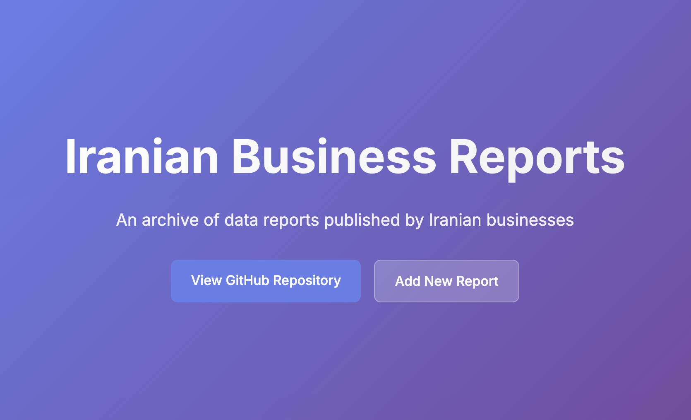

# Iranian Businesses Data Reports

A simple, searchable archive of data reports published by Iranian businesses. Browse by year and category, and download PDFs directly.

- Live site: `https://mahdimajidzadeh.github.io/iranian-businesses-data-reports/`
- Source repository: `https://github.com/MahdiMajidzadeh/iranian-businesses-data-reports`
- Related data source: `https://github.com/saeedesmaili/iranian-businesses-data-reports`

### Features
- Search by title, year, or category
- Filter by year and tags, with a quick "Show All" toggle
- Sorted newest-first
- Direct links to download each report as PDF

### Contributing
- Open an issue to suggest a new report or improvement.
- PRs are welcome for UI/UX, performance, accessibility, or data updates.

---

### Tasks to do
- [ ] add favicon
- [x] add serach
- [x] better view for tags
- [x] add meta tags for better preveiw in socials and other
- [x] add all to filters to show all reports after select one of tags 
