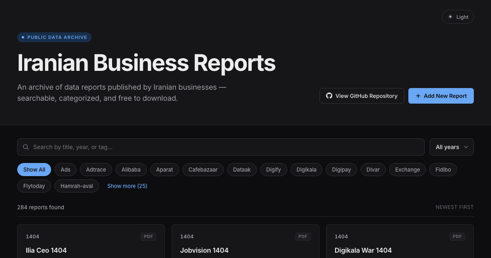

# Iranian Business Reports

An open, searchable archive of data reports published by Iranian businesses — annual reports, market studies, and industry statistics gathered in one place and free to download.

**Visit the site:** https://mahdimajidzadeh.github.io/iranian-businesses-data-reports/

## What you'll find

Hundreds of reports from companies across e-commerce, fintech, logistics, media, and more — collected from across the web and organized so you can quickly find and download what you need. No sign-up, no paywall.

## How to use it

- **Search** — start typing a company, topic, or year in the search box to instantly narrow the list.
- **Filter by category** — click a tag (for example *Fintech* or *E-commerce*) to see only reports in that area. Use **Show more** to reveal all categories.
- **Filter by year** — choose a year from the dropdown.
- **Show All** — clears every filter and brings back the full archive.
- **Download** — click **Download Report** on any card to open its PDF.
- **Dark or light** — use the toggle in the top corner to switch themes; your choice is remembered.

Reports are always sorted newest first.

## Suggest or add a report

Spotted a report that's missing, or have one to share?

- Click **Add New Report** on the site (or open an issue here) to suggest it.
- Corrections and improvements are welcome too — just open an issue.

## Credits

Maintained by [Mahdi Majidzadeh](https://www.linkedin.com/in/mahdimajidzadeh/). Report data builds on the community dataset by [saeedesmaili](https://github.com/saeedesmaili/iranian-businesses-data-reports).
